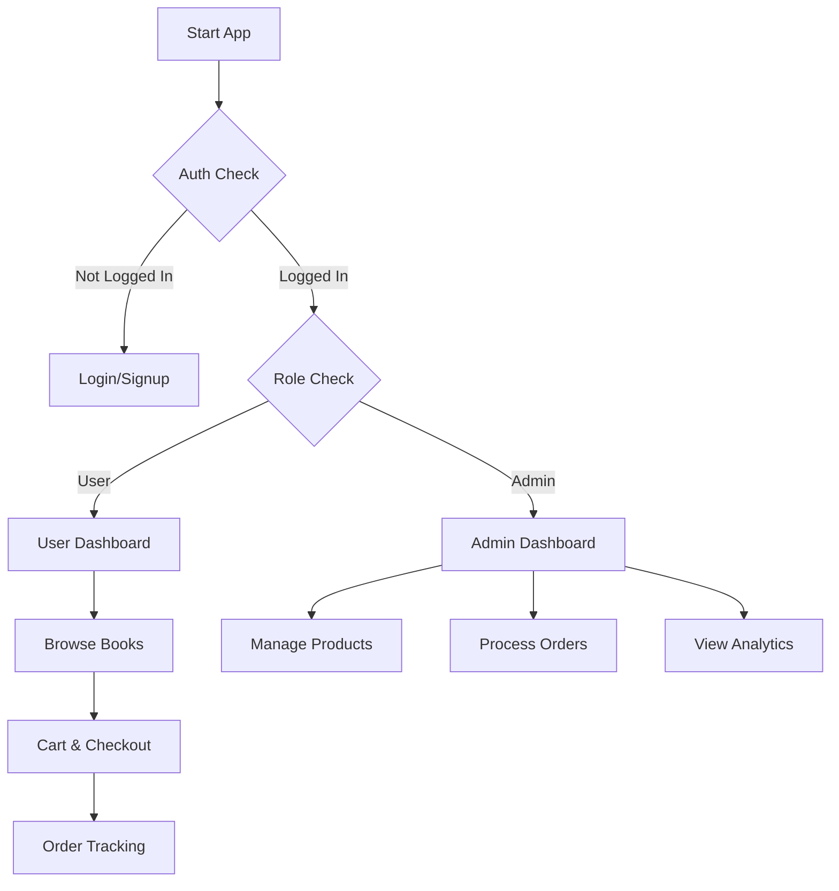

# 📚 Flutter Bookstore App

<div align="center">


**A complete e-commerce solution for book lovers with separate user and admin panels**

[Features](#-features) • [Installation](#-installation) • [Screenshots](#-screenshots) • [Tech Stack](#-tech-stack)

</div>

---

## 🚀 Overview

A beautiful, feature-rich cross-platform mobile application built with **Flutter** and powered by **Firebase**. This app provides a seamless shopping experience with real-time updates and secure transactions.

### 🎯 Key Features

- 📱 **Cross-Platform** - Runs on Android & iOS
- 🔥 **Firebase Backend** - Real-time data sync
- 👥 **Dual Interface** - Separate user and admin panels
- 🛒 **Complete E-commerce** - Cart, checkout, orders, reviews
- 🔒 **Secure** - Firebase Authentication

## 🏗️ Architecture

### Application Flow



---

## ⚡ Quick Installation

### Prerequisites
- Flutter SDK (version 3.0+)
- Firebase Account
- Android Studio / VS Code

### 🛠️ Setup Steps

1. **Clone & Install**
```bash
git clone https://github.com/zainish24/bookstore-app.git
cd bookstore-app
flutter pub get
```

2. **Firebase Configuration**
```bash
# Install FlutterFire CLI
dart pub global activate flutterfire_cli

# Auto-configure Firebase
flutterfire configure
```

3. **Run the App**
```bash
flutter run
```

---

## 🎨 Features

### 👤 User Features
- 🔐 Secure authentication
- 📚 Browse books by categories
- 🔍 Smart search & filters
- 🛒 Shopping cart with totals
- 💝 Wishlist functionality
- 📦 Order tracking
- ⭐ Reviews & ratings

### 👑 Admin Features
- 📊 Dashboard analytics
- 📖 Product management
- 📋 Order processing
- 👥 User management
- 💬 Review moderation

---

## 🏗️ Project Structure

```
lib/
├── components/          # Reusable UI components
├── models/             # Data models
├── screens/            # App screens
│   ├── admin/          # Admin panel
│   ├── auth/           # Authentication
│   └── user/           # User features
├── services/           # Business logic
├── theme/              # App styling
└── main.dart           # App entry point
```

---

## 🔥 Tech Stack

**Frontend**
- Flutter & Dart
- Provider (State Management)
- Material Design

**Backend**
- Firebase Authentication
- Cloud Firestore
- Firebase Storage

---

## 📱 Screens

### User Interface
- Onboarding & Authentication
- Home with Categories
- Product Details & Reviews
- Shopping Cart & Checkout
- Order History & Profile

### Admin Interface
- Dashboard Analytics
- Product Management
- Order Processing
- User Administration

---

## 🗃️ Database Schema

```dart
// Sample Firestore Collections
users/ {userData}
products/ {bookDetails, inventory}
orders/ {orderInfo, status}
reviews/ {ratings, comments}
```

---

## 🚀 Deployment

### Build for Production
```bash
# Android
flutter build apk --release

# iOS
flutter build ios --release

# Web
flutter build web --release
```

---

## 🤝 Contributing

We love contributions! Please:

1. Fork the repository
2. Create your feature branch (`git checkout -b feature/AmazingFeature`)
3. Commit your changes (`git commit -m 'Add AmazingFeature'`)
4. Push to the branch (`git push origin feature/AmazingFeature`)
5. Open a Pull Request

---

## 📄 License

This project is licensed under the MIT License - see the [LICENSE](LICENSE) file for details.

---

## 🙏 Acknowledgments

- Flutter Team for the amazing framework
- Firebase for robust backend services
- Open source community for inspiration

---

<div align="center">

### 💫 Ready to Start?

```bash
git clone https://github.com/zainish24/bookstore-app.git
cd bookstore-app && flutter pub get
flutter run
```

**⭐ Don't forget to star this repo if you find it helpful!**

---

*Built with ❤️ using Flutter & Firebase*

</div>
