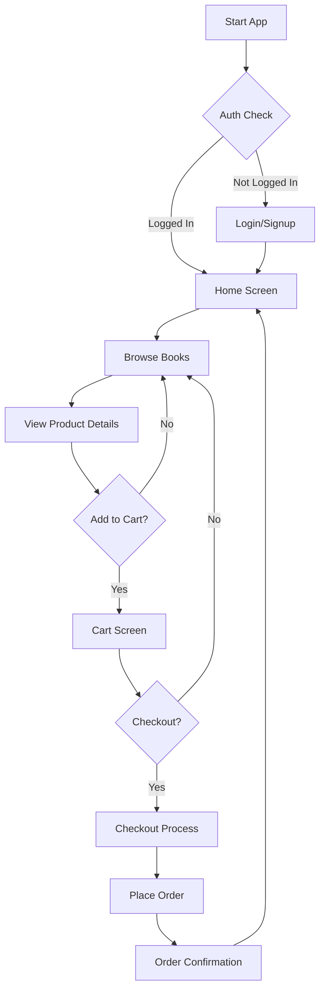
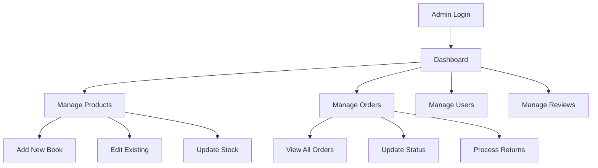

# 📚 Flutter Bookstore App

<div align="center">


**Your Ultimate Mobile Book Shopping Experience 📖✨**

A complete e-commerce solution for book lovers with separate user and admin panels.

</div>

---

## 🌟 About The Project

A beautiful, feature-rich cross-platform mobile application for book lovers! Built with **Flutter** and powered by **Firebase**, this app provides a seamless shopping experience with real-time updates and secure transactions.

### 🎯 Key Highlights
- 📱 **Cross-Platform** - Runs on Android & iOS
- 🔥 **Firebase Backend** - Real-time data sync
- 🎨 **Beautiful UI** - Modern, intuitive design
- ⚡ **Fast Performance** - Smooth user experience
- 🔒 **Secure** - Firebase Authentication
- 👥 **Dual Interface** - Separate user and admin panels
- 🛒 **Complete E-commerce** - Cart, checkout, orders, reviews

---

## 🔄 Core Application Flow

### 📱 User Journey Flowchart



### 👑 Admin Management Flow



---

## ✨ Features

### 👤 User Features
| Feature | Icon | Description |
|---------|------|-------------|
| **User Authentication** | 🔐 | Secure login/signup with Firebase Auth |
| **Book Discovery** | 📚 | Browse by categories, genres, collections |
| **Smart Search** | 🔍 | Find books by title, author, category |
| **Shopping Cart** | 🛒 | Add/remove items, quantity management, totals |
| **Wishlist** | 💝 | Save favorite books for later purchase |
| **Order Management** | 📦 | Place orders, track status, view history |
| **Address Management** | 🏠 | Multiple shipping addresses |
| **Reviews & Ratings** | ⭐ | Rate and review purchased books |

### 👑 Admin Features
| Feature | Icon | Description |
|---------|------|-------------|
| **Admin Dashboard** | 📊 | Sales overview, statistics, quick actions |
| **Product Management** | 📖 | Add, edit, delete books with categories |
| **Order Processing** | 📋 | Manage pending, approved, delivered orders |
| **User Management** | 👥 | View customers and admin accounts |
| **Review Moderation** | 💬 | Approve/remove user reviews and ratings |
| **Inventory Management** | 📈 | Stock tracking and updates |

---

## 🏗️ Project Structure

```
lib/
├── 🎨 components/          # Reusable UI components
│   ├── buttons/           # Custom button widgets
│   ├── cards/             # Product and order cards
│   ├── dialogs/           # Alert and confirmation dialogs
│   └── forms/             # Input forms and validation
├── 📊 models/             # Data models
│   ├── product_model.dart # Book product structure
│   ├── user_model.dart    # User data model
│   ├── order_model.dart   # Order management
│   └── cart_model.dart    # Shopping cart logic
├── 🚦 route/              # App navigation & routing
│   ├── router.dart        # Route configuration
│   └── route_constants.dart
├── 📱 screens/            # All application screens
│   ├── 👑 admin_screens/  # Admin panel
│   │   ├── dashboard.dart
│   │   ├── orders_management.dart
│   │   └── product_management.dart
│   ├── 🔐 auth/           # Authentication
│   │   ├── login_screen.dart
│   │   └── signup_screen.dart
│   └── 👤 user_screens/   # User features
│       ├── home_screen.dart
│       ├── cart_screen.dart
│       └── profile_screen.dart
├── ⚙️ services/           # Business logic & APIs
│   ├── firebase_service.dart
│   ├── auth_service.dart
│   └── cart_service.dart
├── 🎭 theme/              # App styling & themes
│   ├── app_theme.dart
│   └── colors.dart
└── 🔧 main.dart           # Application entry point
```

---

## 🔥 Firebase Setup Instructions

### **Required Configuration**

After cloning this repository, you need to setup Firebase:

1. **Create Firebase Project**
   - Go to [Firebase Console](https://console.firebase.google.com)
   - Create new project
   - Enable **Authentication** (Email/Password)
   - Setup **Firestore Database** in test mode
   - Configure **Firebase Storage**

2. **Automatic Setup (Recommended)**
   ```bash
   # Install FlutterFire CLI
   dart pub global activate flutterfire_cli
   
   # Configure Firebase (auto-generates config files)
   flutterfire configure
   ```

3. **Manual Setup Alternative**
   - Download `google-services.json` to `android/app/`
   - Download `GoogleService-Info.plist` to `ios/Runner/`
   - Copy `lib/firebase_options.dart.template` to `lib/firebase_options.dart`
   - Fill in your Firebase credentials

---

## 🚀 Quick Start

### Prerequisites
- Flutter SDK (version 3.0 or higher)
- Dart SDK
- Firebase Account
- Android Studio / VS Code

### Installation Steps

1. **Clone the repository**
   ```bash
   git clone https://github.com/your-username/bookstore-app.git
   cd bookstore-app
   ```

2. **Install dependencies**
   ```bash
   flutter pub get
   ```

3. **Setup Firebase** (see instructions above)

4. **Run the application**
   ```bash
   flutter run
   ```

### Build for Production
```bash
flutter build apk --release
flutter build ios --release
flutter build web --release
```

---

## 📱 App Screens & Features

### User Interface
| Screen | Description | Features |
|--------|-------------|----------|
| **Onboarding** | Welcome introduction | App overview, skip option |
| **Login/Signup** | User authentication | Firebase Auth, form validation |
| **Home Screen** | Main dashboard | Categories, featured books, search |
| **Product Details** | Book information | Images, reviews, add to cart |
| **Cart Screen** | Shopping cart | Quantity update, totals, coupons |
| **Checkout** | Order placement | Address selection, payment |
| **Profile** | User account | Order history, addresses, settings |

### Admin Interface
| Screen | Description | Features |
|--------|-------------|----------|
| **Dashboard** | Admin overview | Sales stats, quick actions |
| **Orders Management** | Order processing | Status updates, filtering |
| **Products Management** | Inventory control | Add/edit books, categories |
| **Users Management** | User administration | Customer lists, admin roles |

---

## 🛠️ Technology Stack

### Frontend
- **Flutter** - Cross-platform framework
- **Dart** - Programming language
- **Provider** - State management
- **Material Design** - UI components
- **SVG & Animations** - Enhanced visuals

### Backend & Services
- **Firebase Authentication** - Secure user management
- **Cloud Firestore** - Real-time NoSQL database
- **Firebase Storage** - File and image storage

### State Management
Uses **Provider** for efficient state management across:
- 🔐 User authentication state
- 🛒 Shopping cart state
- 📚 Product catalog state
- 📦 Order management state
- ⭐ Reviews and ratings state

---

## 🗃️ Database Architecture

### Firestore Collections Structure:

- **users** 
  - User profiles, addresses, preferences
  - Authentication data and settings

- **products**
  - Book details, categories, inventory
  - Pricing, images, descriptions

- **orders**
  - Order tracking, payment status
  - Shipping information, order items

- **reviews**
  - Product ratings and comments
  - Moderation status, user feedback

---

## 📖 User Guide

### For Customers
1. **Create Account** - Sign up with email verification
2. **Browse Books** - Explore by categories or use search
3. **Add to Cart** - Select quantities and add items
4. **Checkout** - Review order, select address, place order
5. **Track Orders** - Monitor status in profile section

### For Admins
1. **Admin Login** - Use admin credentials
2. **Dashboard Access** - View sales analytics and overview
3. **Manage Inventory** - Add new books, update stock levels
4. **Process Orders** - Update status, handle customer requests
5. **Moderate Content** - Approve reviews, manage users

---

## 🔧 Development

### Key Modules
- **Authentication Module** - Handles user login/signup with Firebase Auth
- **Product Module** - Manages book catalog, categories, and search
- **Cart Module** - Shopping cart functionality with Provider
- **Order Module** - Order processing with Firestore transactions
- **Admin Module** - Comprehensive admin dashboard and management

### Adding New Features
1. Create data models in `models/`
2. Implement services in `services/`
3. Build UI components in `components/`
4. Add screens in appropriate `screens/` directory
5. Update routing in `route/`

---

## 🤝 Contributing

We welcome contributions from the community! Please follow these steps:

1. **Fork the repository**
2. **Create feature branch** 
   ```bash
   git checkout -b feature/AmazingFeature
   ```
3. **Commit your changes**
   ```bash
   git commit -m 'Add some AmazingFeature'
   ```
4. **Push to branch**
   ```bash
   git push origin feature/AmazingFeature
   ```
5. **Open a Pull Request**

### Development Standards
- Follow Dart/Flutter best practices
- Write comprehensive documentation
- Include tests for new features
- Ensure responsive design across platforms

---

## 🐛 Troubleshooting

### Common Issues
- **Firebase configuration errors**: Ensure config files are properly placed
- **Build failures**: Run `flutter clean` and `flutter pub get`
- **Authentication issues**: Check Firebase Auth rules and enabled providers

### Support
- 🐛 [GitHub Issues](https://github.com/your-username/bookstore-app/issues)

---

## 📄 License

This project is licensed under the MIT License - see the [LICENSE](LICENSE) file for details.

---

## 🙏 Acknowledgments

- **Flutter Team** - For the amazing cross-platform framework
- **Firebase Team** - For robust backend services
- **Open Source Community** - For continuous inspiration

---

## 🔮 Future Enhancements

- 💳 Payment gateway integration
- 🤖 AI-based book recommendations
- 🌍 Multi-language support
- 📱 Push notifications
- 📊 Advanced analytics

---

<div align="center">

## 💫 Get Started Today!

**Start your bookstore journey with this complete Flutter & Firebase solution!**

```bash
# Quick start
git clone https://github.com/zainish24/bookstore-app.git
cd bookstore-app
flutter pub get
# Follow Firebase setup instructions above
flutter run
```

**⭐ Don't forget to star this repository if you find it helpful!**

---

*Built with ❤️ using Flutter & Firebase*

</div>
